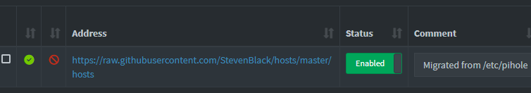
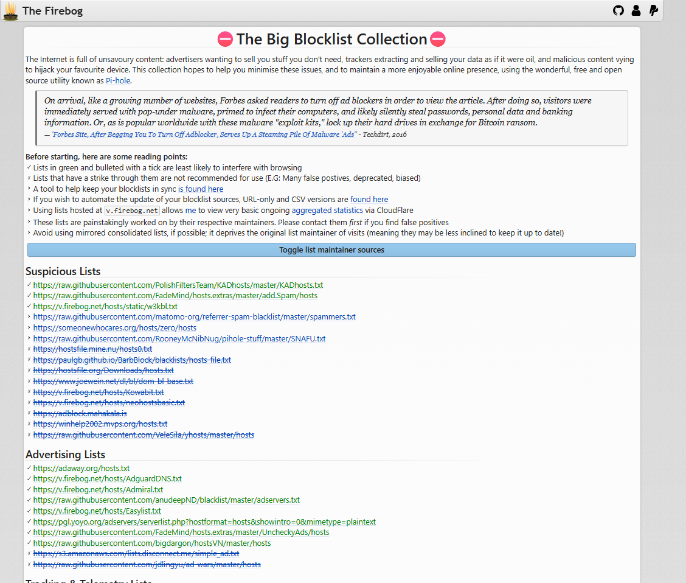
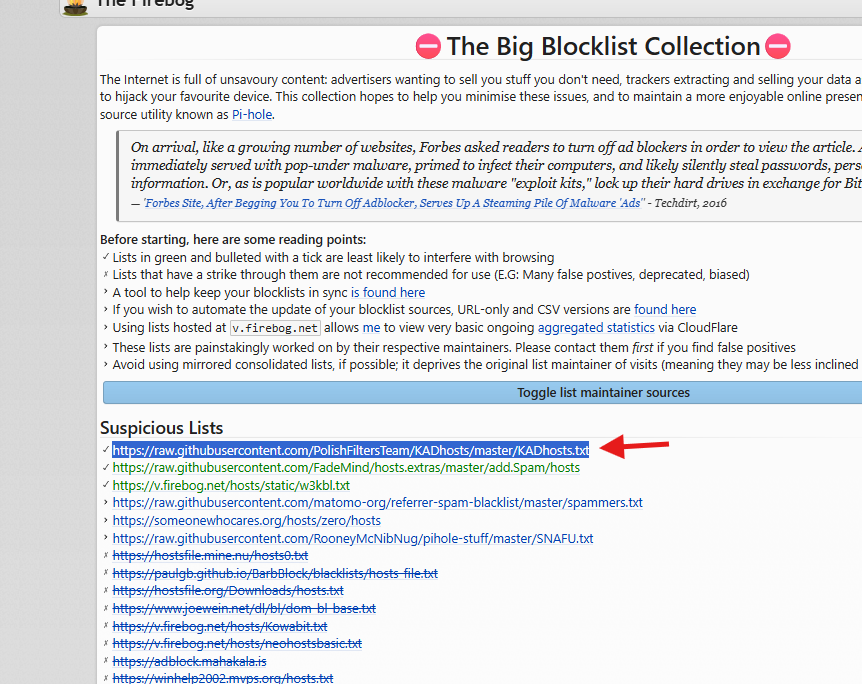
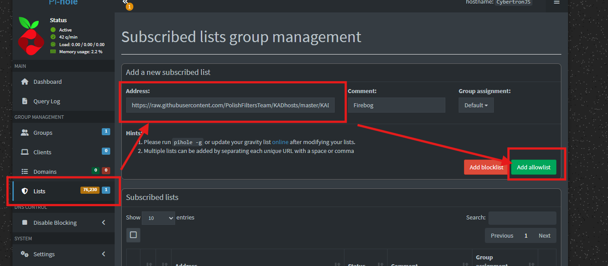
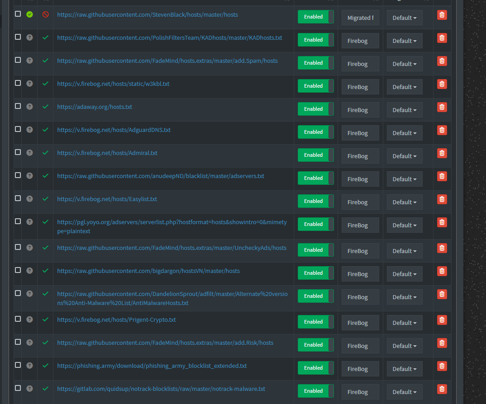
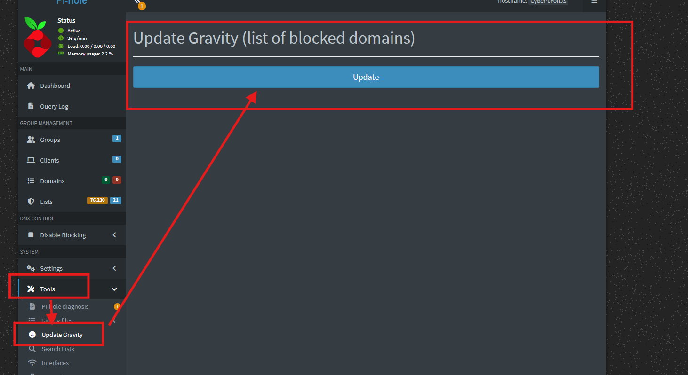
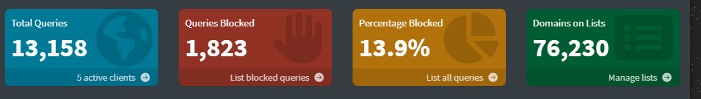
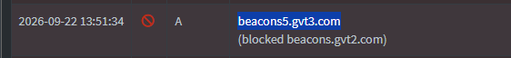

## Adding Pi-hole Block Lists

Creating a DNS block list makes the Internet a nicer place because we want to surf the Internet, making sure that we're blocking ads, trackers, phishing, malware, scams, and other unwanted domains network-wide. 
Because I'm working on Pi-hole, I wanted to research any infamous blocklists I can pull from that will save me time. 

The reason why I built a Pi-hole on my network is that I'm tired of advertisers wanting to sell me stuff I don't need, tracking, extracting, and selling my data, and I don't need any malicious content trying to hijack my device. 

On Pi-hole, there is a section called lists. (below) 

After conducting some research and finding out popular blocklist collections, I landed on The Firebog. It is maintained by different communities, and it is updated regularly.

Before starting, here are some reading points:
Lists in green and bulleted with a tick are least likely to interfere with browsing
Lists that have a strikethrough are not recommended for use (E., many false positives, deprecated, biased)
A tool to help keep your blocklists in sync is found here
If you wish to automate the update of your blocklist sources, URL-only and CSV versions are found here
Using lists hosted at v.firebog.net allows me to view very basic ongoing aggregated statistics via Cloudflare
These lists are painstakingly worked on by their respective maintainers. Please contact them first if you find false positives
Avoid using mirrored consolidated lists, if possible; it deprives the original list maintainer of visits (meaning they may be less inclined to keep it up to date!)

## Steps Taken

1. I will highlight the first suspicious link, " https://raw.githubusercontent.com/PolishFiltersTeam/KADhosts/master/KADhosts.txt" and head over to Pi-Hole.
On my Pi-hole dashboard, I clicked on the Lists tab. Taking a look at the list collection, I will add the highlighted link into the Address section and comment Firebog to note that that is where that link is from. 

2. I continued doing the same steps for all links highlighted in green. 

3. After this, I need to update Gravity. This updates our blocklist. 

# What is this? 

I wanted to see what specifically was being blocked so far, and I stumbled on this link: "	beacons5.gvt3.com "
What I found was that this was a Google-owned subdomain primarily used for telemetry, tracking, and advertising data collection within Google's ads ecosystem. 

Telemetry - a device or piece of software automatically collecting data about itself and sending the data back to whoever made it; in this particular instance, Google is collecting data from me and then sending it back to itself.

