# Creating-My-Cyber-Assistant-Raspberry-Pi-5-AI

# Idea

I was inspired by Mr. Terrific's T-Spheres from the 2025 Superman film; I want to build my own assistant rather than a strict prop replica.
I want to carry it between real places; I want it to understand its new surroundings, build a memory of what it's learned over time, hold a conversation, listen, remember, and run locally on the device itself. Maybe later, have its own cloud system. 

**Status: paused, not cancelled.** I pivoted this same Pi 5 to a networking project first, see the update right below. The original idea and build log stay below for the record, and I'll pick this back up later.

## Update (2026-09-17): pivoted to a networking project

AI assistant is on hold for now. Reused this same Pi 5 to run Pi-hole and WireGuard instead. New goal and build log are under **Networking Project** further down. Original idea and build log stay below, unchanged.

## Why I'm building this

I'm building this as a hands-on project to prove out real IT/hardware skills — imaging Linux, working with hardware peripherals, troubleshooting drivers, documenting a technical build from nothing to a working device. This is a build log, not a finished product pitch.

## Hardware

- Raspberry Pi 5 (8GB)
- AI HAT+2 (Hailo-10H chip, for accelerated AI processing)
- *(more parts added here as they're bought — camera, microphone, speaker, battery, enclosure)*

## Build phases

| Phase | Goal | Status |
|---|---|---|
| 0 — The Brain | Get the core AI stack working on a desk: it hears you, thinks, sees through a camera, talks back, and remembers a fact | Changed |
| 1 — The Shell | Add battery power and a carryable case so it's actually portable | Finished |
| 2 — Integration | Full memory system working reliably while carried between real locations | Not started |
| 3 — The Showcase | Pictures and final write-up | Not started |


## Build Log
# Flashing the microSD card

Before the Pi can do anything, it needs an operating system (the base software everything else runs on top of) written onto a microSD card. Here's how that went:

1. **Downloaded Raspberry Pi Imager** This is the official free tool for writing an operating system onto a microSD card.


2.  **Told it which device I have** selected "Raspberry Pi 5" from the list so it knows what it's preparing the card for. 


3. Almost went with the top option it recommends, "Raspberry Pi OS (64-bit)." Turns out that one runs a full desktop in the background all the time. I'm only ever going to reach this Pi remotely from my PC, never with a monitor plugged into it, so that desktop would just be sitting there eating up memory and power that the AI stuff needs instead. Went into "Raspberry Pi OS (other)" and grabbed **Raspberry Pi OS Lite (64-bit)** instead: same OS, no desktop.


4. Picked which drive was actually the microSD card (there were two plugged in; didn't want to wipe the wrong one).


5. Named it `CybertronJS'. *Reference: Peter Cullen


6. Set my timezone and keyboard layout.  


7. Set up a login: username `josecyber` and a password.


8. Entered my home WiFi name and password so the Pi connects on its own; picked "Secure network" since my WiFi has a password, and left "Hidden SSID" unchecked since my network shows up normally. Please, if you do this, do not share your own private data. 


9. I turned on SSH and set it to password authentication. This one matters a lot: in step 3 I chose Lite because there's no monitor on this. SSH is the only door in. If I don't turn this on now, there's no way to log into the Pi once it boots up, no screen to fall back on, nothing.


10. Got a summary screen: Raspberry Pi 5, Raspberry Pi OS Lite (64-bit), the right storage device. Checked it over and hit write.


11. Let it write to the card. Took a few minutes.


12. Write complete. Card ejected safely on its own, ready to go into the Pi.


Good reminder that "recommended" just means best for most people, not best for what I'm actually building. Card's ready; next step is putting it in the Pi and seeing if it boots.

---
# How Connecting the Cooler to the Raspberry

The cooling fan is bought separately and must be assembled to the Raspberry Pi 5 processor. We need to align the heat sink and the cooling fan and make sure that the 2 spring loaded push pins line up with the two dedicated mounting holes on the board.


I press down gently on the 2 push pins until they firmly snap into the Raspberry Pi 5 board holes, locking the cooler in place. Next, I plugged in the fan's small power connector to the port right next to the USB ports on the edge of the Raspberry Pi 5 board.


Now that that is all set, I can insert the SD card, plug in the Raspberry Pi to the outlet, and turn it on.


---
# Networking Project: Pi-hole + WireGuard

## Why

DNS, DHCP, and VPNs were just exam topics before this. Now I'm running them myself, on the same Pi 5.

## Goal

- **Pi-hole**: DNS server for the house. Blocks ads and trackers, live query log so I can see what every device is actually looking up.
- **WireGuard**: VPN endpoint to get into the home network from outside. Not started yet, next up.

## Reflashing the microSD card

Reused the same card from the AI assistant build above. This time Windows couldn't even see a filesystem on it.

But I ran into a problem. I needed to reflash the microSD card several times.

The first adapter said the card was there but unreadable, then said no media at all. I then swapped to a different adapter; the same card read fine. It was the adapter, not the card.

Writes kept failing mid-write: "storage device was removed while writing," without me touching anything. The adapter was in the front USB port on the tower, so I moved it to a rear port; write finished cleanly.


I unfortunately picked the wrong drive in Imager's storage picker once in the middle of all the adapter swapping. No harm done; just read the device name and size before hitting write every time now.

# Lesson Learned
2 things: Slow down while experimenting, and do not use the tower of the computer you build for data transfers via USB ports. Always use the rear USB ports attached to the motherboard to have a successful data transfer. 

Also hit a gotcha with Imager's advanced settings. Current Raspberry Pi OS builds use `user-data` and `network-config` files to set hostname, SSH, and WiFi, instead of the old `firstrun.sh`. First pass, none of my settings actually took; the files came back as untouched defaults. Closing that warning window isn't the same as hitting Save inside it. Caught it by checking the files on the card directly before putting it back in the Pi.

## Installing Pi-hole

Connected over SSH and updated the system first:

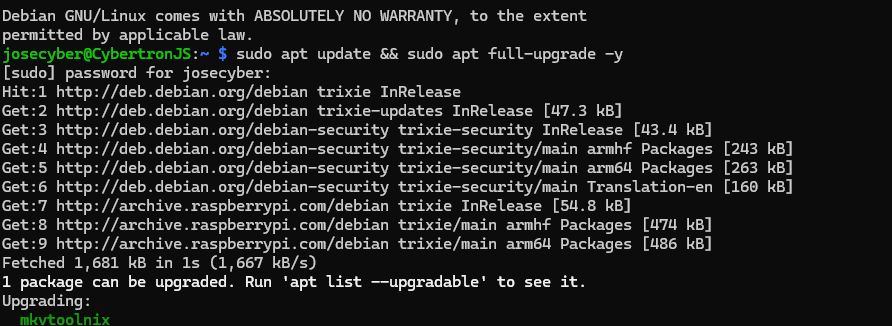

Ran Pi-hole's install script:

```
curl -sSL https://install.pi-hole.net | sudo bash
```

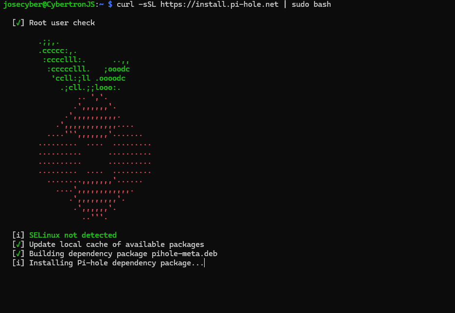

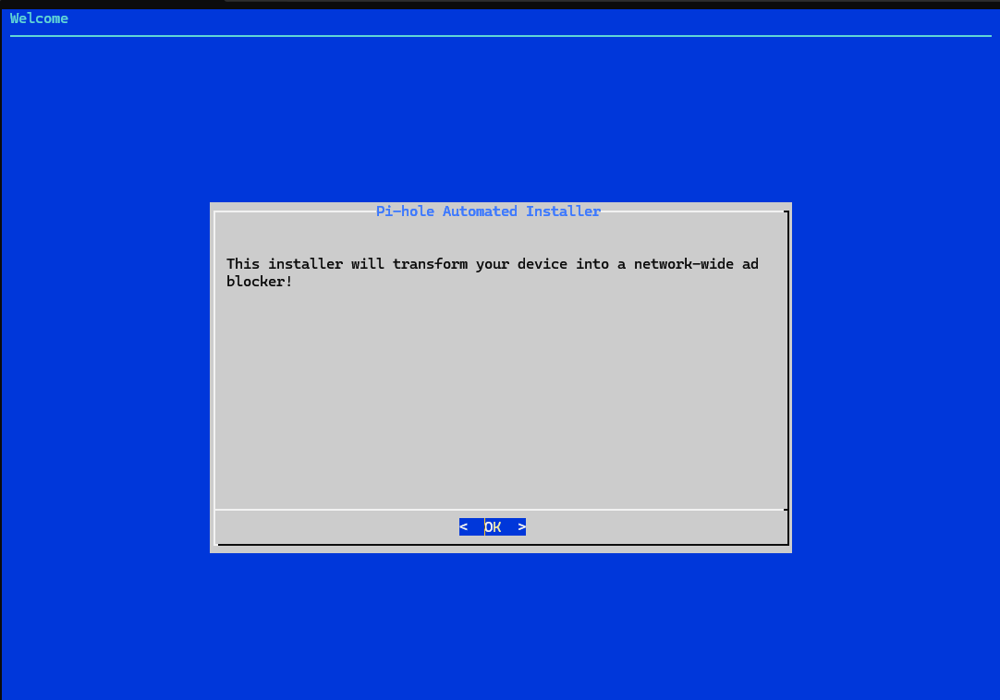

Picked Cloudflare as the upstream DNS:

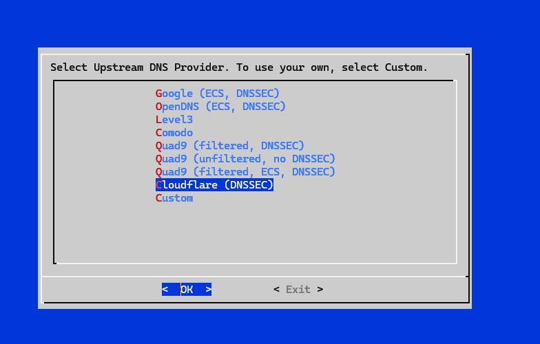

Left the default StevenBlack blocklist checked:

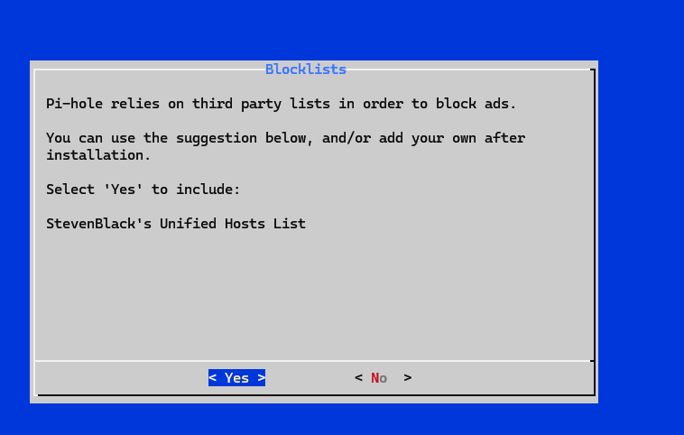

Turned on query logging so I can actually watch DNS lookups happen instead of guessing:

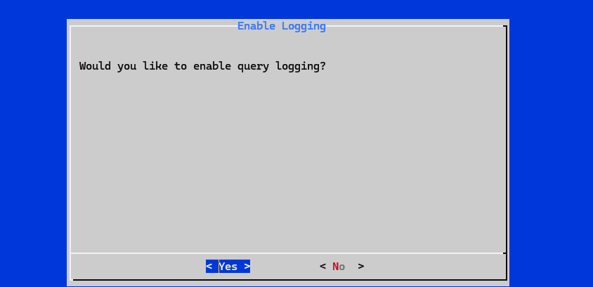

Left privacy mode on "Show everything":

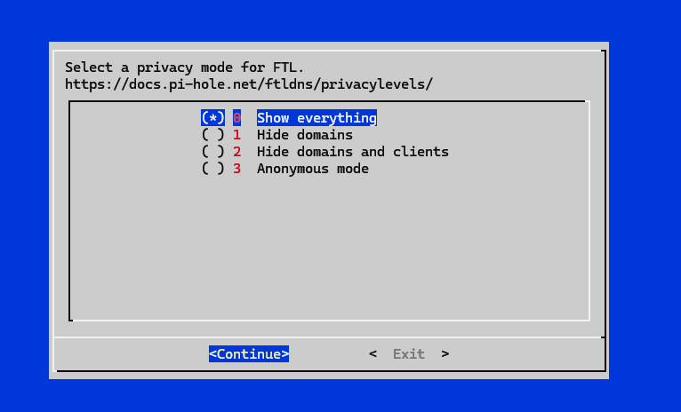

Installer picked up my network interface and IP, pulled Pi-hole's repos, installed FTL, landed on the login screen:

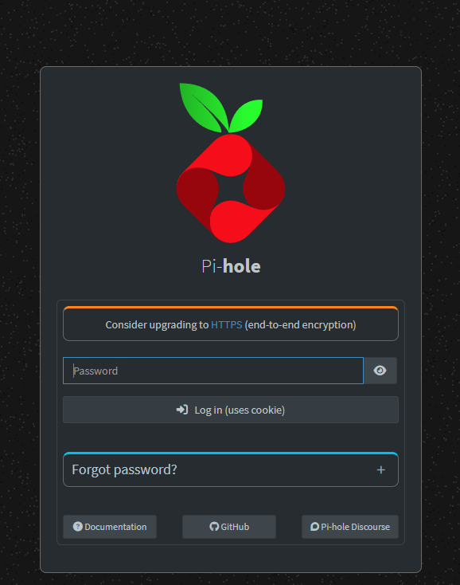

Pointed my PC's DNS at the Pi. Query log started filling up right away, some blocked, most just resolved normal.

Pointed the router's DNS at the Pi too, not just my PC. Whole house is covered now.

## Setting up WireGuard

Installed PiVPN to handle it:

```
curl -L https://install.pivpn.io | bash
```

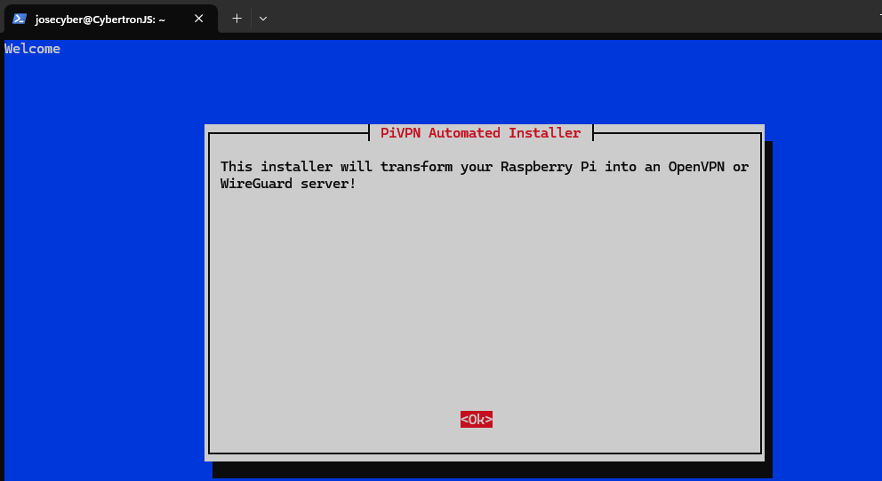

It asked if the Pi's IP was reserved through DHCP reservation on the router. Went looking on the Verizon admin page, the Devices menu only shows connection stats, no reservation option there. Skipped it since the Pi stays connected most of the time anyway.

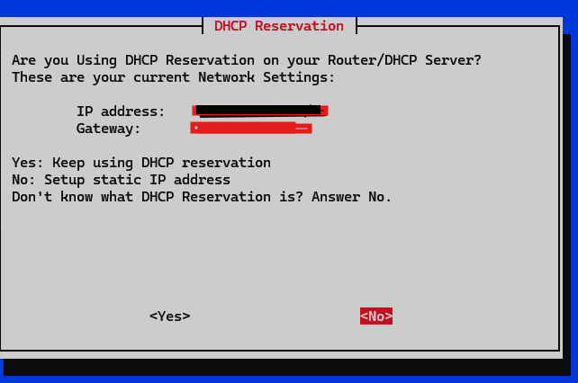

Picked WireGuard over OpenVPN.

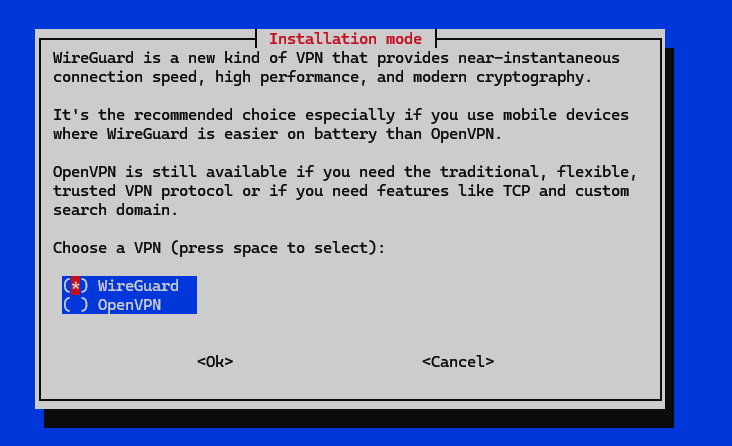

It found the Pi-hole install already on the box and asked if VPN clients should use it as DNS too. Said yes, so ad blocking still works on my phone when I'm connected remotely.

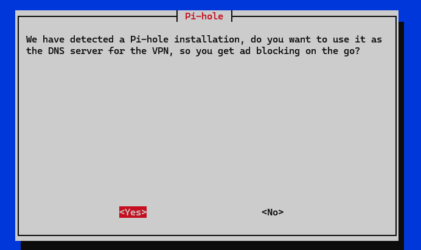

Asked whether clients connect using a public IP or a DNS name. Verizon residential doesn't hand out a static IP, so went with a DNS name instead.

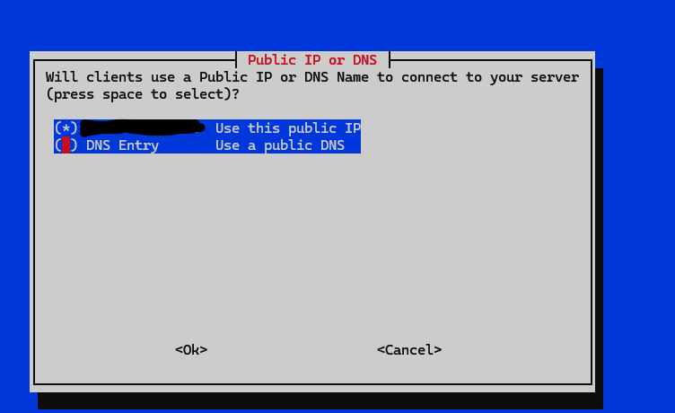

Set up a free DuckDNS address for that.

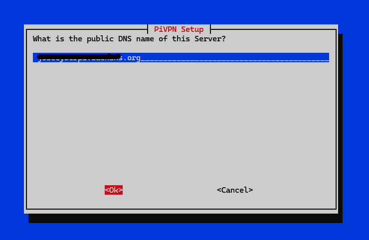

Turned on unattended security upgrades, since this Pi is reachable from outside now.

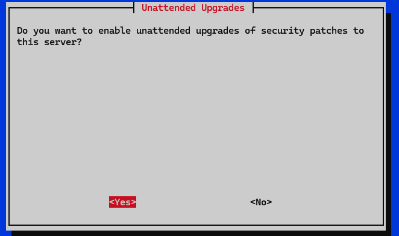

Installation complete.

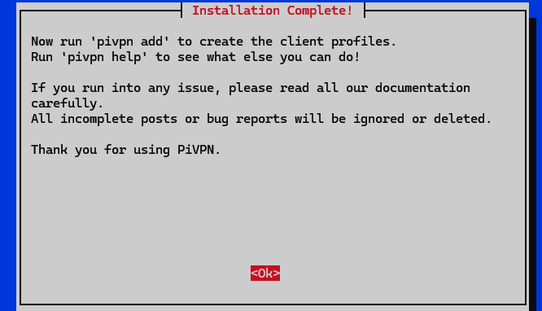

## What's next

- Forward UDP port 51820 on the router to the Pi
- Run `pivpn add` for a client profile, then `pivpn -qr` to get it on my phone
- Maybe come back to VLANs for the IoT stuff later


